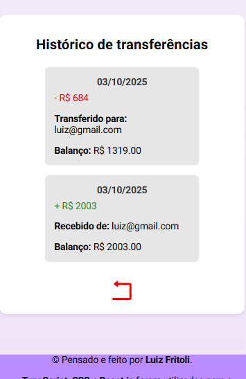
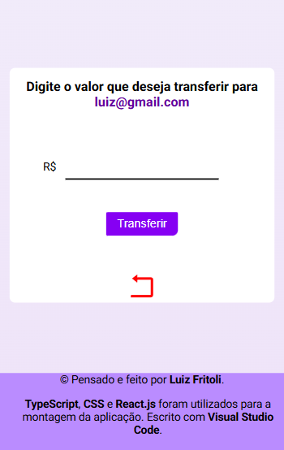
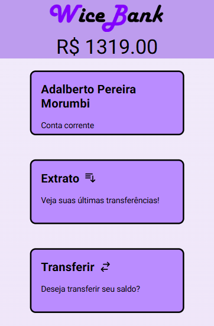

# WiceBank

[](http://makeapullrequest.com)


## Saiba mais sobre o WiceBank

### O que é o WiceBank

O WiceBank é uma simulação de um banco digital, onde se possui funções como transferir
saldo, receber saldo e ver o histórico das transações, com as mesmas sendo simples e
intuitivas, podendo ser facilmente executadas pelo usuário.

### Funcionalidades do WiceBank

 **Transferir:** É possível transferir o saldo para outros usuários, utilizando o email. Disponível na opção transferir.

 **Receber:** Na opção receber, o usuário especifica quanto de saldo fictício ele quer receber.

 **Extrato:** A funcionalidade extrato permite ao usuário ver o histórico de transferências ou recebimentos.


## Demonstração

<p>
  
  
  
</p>

[Acesse a versão online aqui](https://wicebank.vercel.app)


## Instruções de instalação

### Pré-requisitos

#### Node (18.x ou superior)

#### Npm (Junto com o Node)

#### Git (Para clonagem do projeto)

---

1. Crie uma pasta no computador, e rode com um terminal:

```bash
git clone https://github.com/luizfritoli/wicebank.git
```

2. Após isso, rode:

```bash
cd wicebank
```

3. Por fim, instale as dependências:

```bash
npm install
```

## Instruções de uso

1. Para rodar o projeto, abra o terminal do VS Code e use:

```bash
npm run dev
```

O projeto abrirá de forma automática. Ou entre em http://localhost:3000
após o uso do comando.

2. Na seção inicial, é possível clicar em "Entrar", caso já tenha uma conta
registrada, ou, "Não tenho uma conta", caso não tenha uma conta. Ao clicar em um dos
botões, será redirecionado para um formulário, onde basta preencher as informações para
registrar ou entrar.

3. Ao colocar as informações no formulário para entrar, o usuário será redirecionado ao banco,
onde poderá executar as funcionalidades simples de um banco digital, como transferir, receber e
ver extrato.

4. Para sair, ou mudar de conta (para testar funcionalidades da aplicação), basta clicar no último card
do banco "Sair". Assim, o usuário será redirecionado para a área de entrar, local onde poderá entrar com
outra conta para analisar funcionalidades.